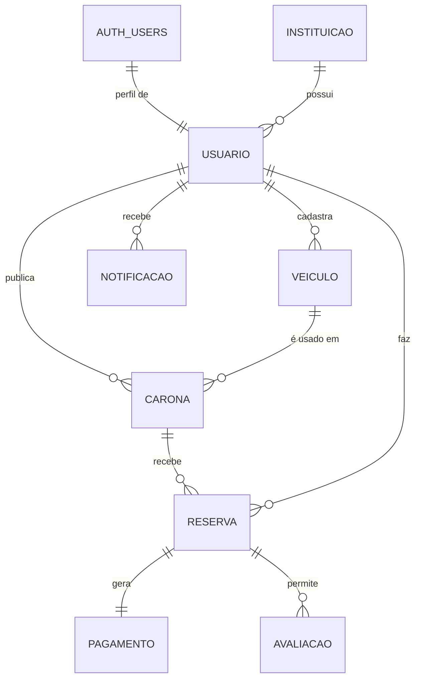

# DATABASE.md — Modelo de dados

> Fonte: DER da Aula 08. **Qualquer mudança aqui exige atualizar o DER e criar migration pelo Supabase CLI.**
> Banco: PostgreSQL (Supabase). Acesso: supabase-js (app) e funções SQL / Edge Functions (backend). Colunas em `snake_case`.

## Diagrama ER

`AUTH_USERS` é a tabela `auth.users`, gerenciada pelo Supabase Auth (e-mail, hash da senha, confirmação). O projeto não altera o schema `auth`.

## Dicionário de dados

Tipos para as migrations SQL. `PK` = chave primária, `FK` = chave estrangeira.

### INSTITUICAO
| Coluna | Tipo | Regras |
|---|---|---|
| id_instituicao | INT | PK, `generated always as identity` |
| nome | VARCHAR(120) | obrigatório |
| dominio_email | VARCHAR(80) | obrigatório, UNIQUE, sem `@` (ex.: `ulbra.br`) |

### USUARIO (perfil — 1:1 com `auth.users`)
| Coluna | Tipo | Regras |
|---|---|---|
| id_usuario | UUID | PK, FK → `auth.users(id)` `on delete cascade` |
| id_instituicao | INT | FK → INSTITUICAO |
| nome_completo | VARCHAR(120) | obrigatório |
| email_institucional | VARCHAR(160) | obrigatório, UNIQUE, minúsculo (cópia de `auth.users.email`) |
| genero | ENUM `FEMININO`, `MASCULINO`, `OUTRO`, `NAO_INFORMADO` | usado no filtro US05 |
| telefone | VARCHAR(20) | opcional |
| expo_push_token | VARCHAR(100) | opcional; registrado pelo app (T29) |
| criado_em | TIMESTAMPTZ | default `now()` |

Criada pelo trigger `criar_perfil_usuario` (AFTER INSERT em `auth.users`), a partir de `raw_user_meta_data`. Senha e confirmação de e-mail ficam em `auth.users` (`encrypted_password`, `email_confirmed_at`).

### VEICULO
| Coluna | Tipo | Regras |
|---|---|---|
| id_veiculo | UUID | PK, default `gen_random_uuid()` |
| id_motorista | UUID | FK → USUARIO, default `auth.uid()` |
| modelo | VARCHAR(60) | obrigatório |
| placa | VARCHAR(8) | obrigatório, UNIQUE, CHECK formato antigo ou Mercosul |
| cor | VARCHAR(30) | obrigatório |
| qtd_lugares | SMALLINT | CHECK 2 a 8 |
| motorizacao | VARCHAR(10) | ex.: `1.0`, `1.6` — só sugere o consumo inicial |
| consumo_kml | DECIMAL(4,1) | CHECK > 0; alimenta a sugestão de preço |

### CARONA
| Coluna | Tipo | Regras |
|---|---|---|
| id_carona | UUID | PK |
| id_motorista | UUID | FK → USUARIO |
| id_veiculo | UUID | FK → VEICULO (do mesmo motorista) |
| origem | VARCHAR(200) | endereço legível |
| origem_lat / origem_lng | DECIMAL(9,6) | busca por proximidade |
| destino | VARCHAR(200) | endereço legível |
| destino_lat / destino_lng | DECIMAL(9,6) | |
| distancia_km | DECIMAL(6,2) | nulo até a Sprint 3 |
| data_hora_partida | TIMESTAMPTZ | no futuro na criação |
| vagas_disponiveis | SMALLINT | CHECK ≥ 0; ≤ `qtd_lugares − 1` na criação |
| custo_estimado | DECIMAL(10,2) | nulo até a Sprint 3; teto do preço |
| custo_total | DECIMAL(10,2) | CHECK > 0; ≤ `custo_estimado` quando houver |
| tolerancia_min | SMALLINT | CHECK 0 a 30 |
| somente_mulheres | BOOLEAN | default `false` |
| status | ENUM `ABERTA`, `LOTADA`, `CANCELADA`, `CONCLUIDA` | default `ABERTA` |

### RESERVA (associativa USUARIO N:N CARONA)
| Coluna | Tipo | Regras |
|---|---|---|
| id_reserva | UUID | PK |
| id_carona | UUID | FK → CARONA |
| id_passageiro | UUID | FK → USUARIO |
| valor_individual | DECIMAL(10,2) | rateio calculado na função `reservar_vaga` |
| status | ENUM `PENDENTE`, `CONFIRMADA`, `CANCELADA`, `EXPIRADA` | default `PENDENTE` |
| criado_em | TIMESTAMPTZ | default `now()`; base para expiração |

Índice único parcial: (`id_carona`, `id_passageiro`) onde status em (`PENDENTE`, `CONFIRMADA`) — impede reserva dupla.

### PAGAMENTO (1:1 com RESERVA)
| Coluna | Tipo | Regras |
|---|---|---|
| id_pagamento | UUID | PK |
| id_reserva | UUID | FK → RESERVA, UNIQUE |
| id_externo | VARCHAR(64) | UNIQUE; id da cobrança no Mercado Pago (idempotência) |
| valor | DECIMAL(10,2) | = `valor_individual` |
| taxa_plataforma | DECIMAL(10,2) | `valor × percentual_taxa` |
| valor_repassado | DECIMAL(10,2) | `valor − taxa_plataforma` |
| metodo | ENUM `PIX` | |
| status | ENUM `PENDENTE`, `APROVADO`, `RECUSADO`, `REEMBOLSO_PENDENTE` | |
| pago_em | TIMESTAMPTZ | preenchido pelo webhook |

### AVALIACAO
| Coluna | Tipo | Regras |
|---|---|---|
| id_avaliacao | UUID | PK |
| id_reserva | UUID | FK → RESERVA |
| id_avaliador | UUID | FK → USUARIO |
| id_avaliado | UUID | FK → USUARIO |
| nota | SMALLINT | CHECK 1 a 5 |
| comentario | VARCHAR(500) | opcional |

UNIQUE (`id_reserva`, `id_avaliador`).

### NOTIFICACAO
| Coluna | Tipo | Regras |
|---|---|---|
| id_notificacao | UUID | PK |
| id_usuario | UUID | FK → USUARIO |
| tipo | ENUM `NOVA_RESERVA`, `RESERVA_CONFIRMADA`, `CARONA_CANCELADA`, `RESERVA_CANCELADA`, `AVALIACAO` | |
| mensagem | VARCHAR(300) | |
| lida | BOOLEAN | default `false` |
| criado_em | TIMESTAMPTZ | default `now()` |

### PARAMETRO_CUSTO
| Coluna | Tipo | Regras |
|---|---|---|
| id_parametro | INT | PK |
| preco_litro | DECIMAL(5,2) | mantido pela equipe |
| percentual_taxa | DECIMAL(5,4) | ex.: `0.0500` = 5% |
| atualizado_em | TIMESTAMPTZ | |

O registro mais recente é o vigente. Sem acesso pelo app (RLS sem políticas).

## Cardinalidades

| Relacionamento | Card. | Leitura |
|---|---|---|
| auth.users — USUARIO | 1:1 | Cada conta do Auth tem um perfil |
| INSTITUICAO — USUARIO | 1:N | Uma instituição possui vários alunos |
| USUARIO — VEICULO | 1:N | Um motorista cadastra vários veículos |
| USUARIO — CARONA | 1:N | Um motorista publica várias caronas |
| VEICULO — CARONA | 1:N | Um veículo é usado em várias caronas |
| CARONA — RESERVA | 1:N | Uma carona recebe várias reservas |
| USUARIO — RESERVA | 1:N | Um passageiro faz várias reservas |
| USUARIO — CARONA (via RESERVA) | N:N | Resolvido pela associativa RESERVA |
| RESERVA — PAGAMENTO | 1:1 | Cada reserva gera um pagamento |
| RESERVA — AVALIACAO | 1:N | Avaliação mútua entre participantes |
| USUARIO — NOTIFICACAO | 1:N | Um usuário recebe várias notificações |

## Row Level Security (resumo)

RLS habilitada em **todas** as tabelas. Escrita em tabelas com regra de negócio só por funções SQL (`SECURITY DEFINER`).

| Tabela | SELECT | INSERT / UPDATE / DELETE pelo app |
|---|---|---|
| instituicao | todos os autenticados | — |
| usuario | só a própria linha (`id_usuario = auth.uid()`) | UPDATE da própria linha (colunas liberadas por `grant update (...)`) |
| veiculo | só os próprios | todos, só nos próprios |
| carona | motorista vê as próprias; busca/detalhe via funções | — (funções `publicar_carona`, `cancelar_carona`, `concluir_carona`) |
| reserva | passageiro vê as próprias; motorista vê as das suas caronas | — (Edge Function `reservar-vaga`, função `cancelar_reserva`) |
| pagamento | passageiro da reserva | — (Edge Functions) |
| avaliacao | avaliador e avaliado | — (função `avaliar_participante`) |
| notificacao | só as próprias | UPDATE da coluna `lida` nas próprias |
| parametro_custo | — | — |

View `perfil_publico` (`security_invoker = false`, só colunas públicas): nome e média de avaliações.

## Funções, triggers e jobs

| Objeto | Tipo | Papel |
|---|---|---|
| `validar_dominio_institucional` | Auth Hook (Before User Created) | RN01 |
| `criar_perfil_usuario` | Trigger em `auth.users` | Cria a linha de USUARIO |
| `publicar_carona`, `buscar_caronas`, `detalhar_carona`, `cancelar_carona`, `concluir_carona` | Funções RPC | Módulo caronas |
| `reservar_vaga`, `cancelar_reserva`, `expirar_reservas` | Funções | Módulo reservas (RN11, RN14–RN18) |
| `registrar_pagamento`, `confirmar_pagamento` | Funções (só `service_role`) | Módulo pagamentos (RN13) |
| `avaliar_participante` | Função RPC | RN19 |
| Triggers de notificação | Triggers em `reserva`/`carona` | Gravam NOTIFICACAO |
| `expirar-reservas` | Job pg_cron (a cada minuto) | RN16 |
| Webhook `notificacao` INSERT | Database Webhook | Chama a Edge Function `enviar-push` |

## Alterações propostas em relação ao DER da Aula 08

Pendentes de aprovação do squad (e de atualização do DER):

- `USUARIO.id_usuario` passa a ser FK para `auth.users(id)`; **saem** `senha_hash` e `email_verificado` (ficam no Supabase Auth — ADR-009).
- `RESERVA.status`: incluir `CANCELADA` e `EXPIRADA`.
- `PAGAMENTO.status`: valores `PENDENTE`, `APROVADO`, `RECUSADO`, `REEMBOLSO_PENDENTE`.
- `USUARIO.expo_push_token` (VARCHAR, opcional): necessário para enviar push (T29).
- `PAGAMENTO.id_externo` (VARCHAR, UNIQUE): id da cobrança no Mercado Pago, usado para idempotência do webhook.

## Migrations

- Criar sempre com `supabase migration new <descricao>` (ex.: `init`, `rls_base`, `reserva_pagamento`) e escrever o SQL no arquivo gerado.
- Toda migration que cria tabela também habilita RLS e cria as políticas no mesmo arquivo.
- Testar com `supabase db reset` (local) antes do PR; aplicar no projeto remoto com `supabase db push` (via deploy da `main`).
- Nunca editar migration já aplicada na `develop`; criar uma nova. Nunca alterar o schema pelo painel do projeto remoto.
- **Dados essenciais** (INSTITUICAO ULBRA e PARAMETRO_CUSTO inicial) vão em migration idempotente (`insert ... on conflict do nothing`), porque `seed.sql` só roda localmente.
- `supabase/seed.sql`: dados de desenvolvimento (usuários, veículos e caronas de teste).

## Performance

- Índices: `carona(status, data_hora_partida)`, `carona(origem_lat, origem_lng)`, `reserva(id_carona)`, `reserva(id_passageiro)`, `notificacao(id_usuario, lida)`.
- Colunas usadas nas políticas RLS (`id_motorista`, `id_passageiro`, `id_usuario`) indexadas; nas políticas, usar `(select auth.uid())` para o Postgres avaliar uma vez por consulta.
- Busca por proximidade no MVP: dentro de `buscar_caronas`, filtro por bounding box (lat/lng ± delta) + distância haversine em SQL. PostGIS fica para depois, se necessário.
