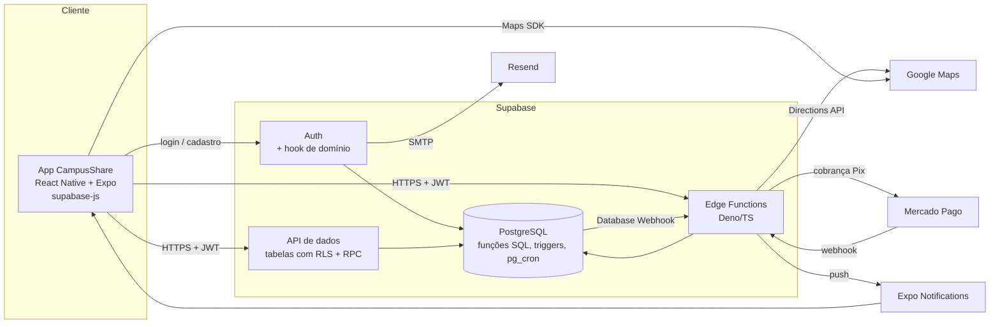

# Arquitetura — CampusShare

> Corresponde ao **Plano** no SDD. Origem: documento "Arquitetura, Modelagem de Dados e Planejamento da Implementação" (Aula 08, 17/09/2026), revisado em 24/09/2026 para backend direto no Supabase (ADR-009).

## Restrições que guiaram as decisões

- Squad de 3 integrantes
- Prazo até a AP2 (22/10/2026), cerca de 4 semanas
- Orçamento zero
- Android e iOS a partir de uma única base de código

## Modelo arquitetural

Cliente-servidor em **três camadas lógicas**, com o backend fornecido pelo **Supabase** (ADR-009). Não há API própria em Node.js/Express.

| Camada | Responsabilidade |
|---|---|
| Apresentação (app) | Só interface: telas, navegação, chamadas ao Supabase via `supabase-js`. Nenhuma regra de negócio crítica. |
| Backend (Supabase) | **Auth** (cadastro, confirmação de e-mail, sessão); **RLS** (quem lê/escreve o quê); **funções SQL** (regras transacionais: publicar, reservar, rateio, cancelar, avaliar); **Edge Functions** (Pix, webhook, Directions, push); **pg_cron** (expiração). |
| Dados | PostgreSQL com as entidades do domínio. |

## Diagrama macro



## Módulos do backend

| Módulo | Responsabilidade | Entidades | Onde é implementado |
|---|---|---|---|
| `auth` | Cadastro, confirmação de e-mail, login, sessão | USUARIO, INSTITUICAO | Supabase Auth + hook `validar_dominio_institucional` + trigger que cria o perfil |
| `usuarios` | Perfil, push token, reputação | USUARIO | Tabela com RLS + view `perfil_publico` |
| `veiculos` | CRUD de veículos do motorista | VEICULO | Tabela com RLS + constraints |
| `caronas` | Publicar, buscar, cancelar, concluir, sugestão de preço | CARONA, PARAMETRO_CUSTO | Funções SQL + Edge Functions `sugestao-preco` / `publicar-carona` (Sprint 3) |
| `reservas` | Reservar vaga, rateio, expiração, cancelamento | RESERVA | Função SQL `reservar_vaga` + Edge Function `reservar-vaga` + pg_cron |
| `pagamentos` | Cobrança Pix, webhook, taxa e repasse | PAGAMENTO, PARAMETRO_CUSTO | Edge Functions `reservar-vaga` / `webhook-mercado-pago` + funções SQL |
| `notificacoes` | Histórico e envio de push | NOTIFICACAO | Triggers + Database Webhook + Edge Function `enviar-push` |
| `avaliacoes` | Avaliação mútua | AVALIACAO | Função SQL `avaliar_participante` |

Cada módulo é dono das próprias tabelas; outro módulo chama as **funções** dele em vez de escrever nas tabelas dele. Contratos em `docs/API.md`.

## Fluxo principal — Reservar vaga (UC05)

O fluxo mais complexo: envolve rateio, serviço externo de pagamento e uma etapa assíncrona (webhook).

```mermaid
sequenceDiagram
    actor P as Passageiro
    participant A as App
    participant EF as Edge Function<br/>reservar-vaga
    participant DB as PostgreSQL
    participant MP as Mercado Pago
    participant WH as Edge Function<br/>webhook-mercado-pago

    P->>A: Toca em "Reservar"
    A->>EF: functions.invoke('reservar-vaga') + JWT
    EF->>EF: Valida JWT (id do passageiro) e payload (Zod)
    EF->>DB: rpc reservar_vaga(p_id_carona, p_id_passageiro)
    Note over DB: Transação única:<br/>SELECT carona FOR UPDATE<br/>valida vagas, RN14, RN18<br/>calcula valor_individual<br/>INSERT reserva PENDENTE; vagas - 1
    DB-->>EF: reserva + valor
    EF->>MP: Cria cobrança Pix
    MP-->>EF: id externo, QR code, copia-e-cola
    EF->>DB: rpc registrar_pagamento (PENDENTE, taxa, repasse)
    EF-->>A: 201 reserva + dados do Pix
    A-->>P: Exibe QR code

    Note over P,WH: Etapa assíncrona
    P->>MP: Paga o Pix
    MP->>WH: POST /functions/v1/webhook-mercado-pago
    WH->>WH: Valida assinatura; consulta a cobrança no MP
    WH->>DB: rpc confirmar_pagamento(id_externo) — idempotente
    Note over DB: pagamento APROVADO; reserva CONFIRMADA;<br/>trigger grava NOTIFICACAO
    WH-->>MP: 200
    DB-->>A: Realtime: reserva CONFIRMADA
    DB->>EF: Database Webhook → enviar-push → "Reserva confirmada"
```

A reserva só vira `CONFIRMADA` com o webhook (ADR-008). Se a cobrança falhar ao ser criada, a Edge Function cancela a reserva e devolve a vaga. Se o pagamento não chegar no prazo, o job do pg_cron expira a reserva e devolve a vaga.

## Regra de precificação

```
custo_estimado   = (distancia_km ÷ consumo_kml) × preco_litro
valor_individual = custo_total ÷ n_ocupantes
taxa_plataforma  = valor × percentual_taxa
valor_repassado  = valor − taxa_plataforma
```

- `distancia_km`: Directions API (Edge Function). `consumo_kml`: cadastro do veículo (motorização só sugere o valor inicial). `preco_litro` e `percentual_taxa`: PARAMETRO_CUSTO.
- Rateio, taxa e repasse são calculados nas funções SQL; o teto é aplicado na publicação (ADR-007).
- Etapas: Sprint 2 com valor digitado (função SQL `publicar_carona` chamada pelo app); Sprint 3 com sugestão automática e teto (Edge Function `publicar-carona` calcula a distância e chama a função SQL).

## Ambientes

| Ambiente | Backend | App |
|---|---|---|
| Desenvolvimento | Supabase local (`supabase start`, Docker) | Expo Go |
| Demo (AP2) | Projeto Supabase (free) — migrations via `supabase db push`, funções via `supabase functions deploy` | Build EAS instalado |

## Planejamento por sprint

| Sprint | Entrega | Tarefas |
|---|---|---|
| 1 (Aula 10) | Setup, schema base com RLS, cadastro institucional, login, deploy | T01–T14 |
| 2 | Veículos, caronas, reserva com rateio, Pix sandbox | T15–T25 |
| 3 | Sugestão de preço, mapa, cancelamento, notificações, avaliações, build | T26–T31 |

## Decisões relacionadas

Ver `docs/adr/` — ADR-001 a ADR-009. A ADR-009 substitui as ADR-002 e ADR-004 e parte da ADR-003.
